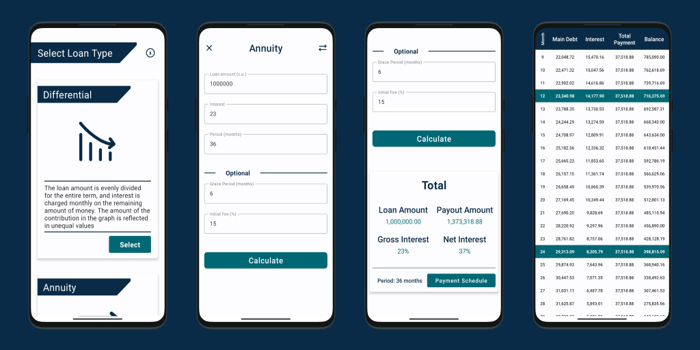

# Loan Calculator

 

_ _ _ 

## Introductions
Loan Calculator will help to determine the payment schedule on a loan. Simply enter the loan amount, term and interest rate in the fields and calculate it. 
The Project is based on **Jetpack Compose**.

## Previews

_ _ _
 

## Technology Stack
- **Kotlin**
- **Jetpack**
	- Compose
	- Navigation
	- ViewModel
	- Lifecycle
- **Firebase**
	 - Performance Monitoring
	 - Crashlytics 
	 - Analytics
- **Admob**
_ _ _
 